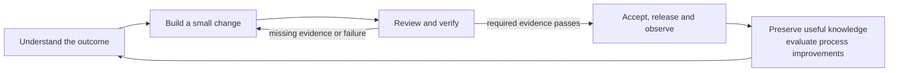

# Agent Harness

A shared process and set of tools for AI-assisted software development. The
harness tells an assistant what context to read, how to organize work, what
counts as verification, and what to preserve for the next task.

Use it to turn a request into a checked result, then improve future work from
what happened. The core applies across product domains, technology stacks,
models and agent clients. The optional local checking tools use Node.js 20+
without third-party dependencies.

## Start with one task

Open a project containing the harness in an assistant that can read its files.
Give it your intended outcome and constraints:

```text
Read AGENTS.md and use this project's harness for the following task.

Outcome: <the observable result I want>
Constraints: <scope, compatibility, time or other limits>

Inspect the existing implementation and relevant project decisions. Choose a
workflow proportional to the risk, carry out the authorized work, and verify
it. Report what changed, evidence for the result, remaining gaps, and any
context or feedback worth preserving.
```

The assistant loads the relevant instructions and runs the project checks it
can access. Its available tools and permissions determine what it can execute.
Task names such as `define-spec` and `qa` refer to instruction files; they do
not require installed slash commands.

For setup, task selection, resuming work and a feature walkthrough, follow
[How to use the harness](docs/getting-started.md).

## The principles

| Principle | What it changes in everyday work |
|---|---|
| Define success before implementation | Describe observable outcomes and important constraints so completion can be checked. |
| Scale the process to risk | Use a short intent/check/result for a small fix; add design, planning and independent review where they reduce uncertainty. |
| Make evidence easy to obtain | Work in small increments and run the cheapest check that can expose the plausible failure. |
| Keep context current | Preserve source-backed decisions and facts; recheck them after source changes or expiry. |
| Keep quality dimensions visible | A passing test cannot erase a missing security, compatibility or recovery check that the change requires. |
| Learn from normal work | Capture minimal outcomes, investigate their causes, and preserve only useful verified knowledge. |
| Evaluate improvements before adopting them | Compare the current and proposed workflow on failures, safe cases and unseen work; account for human effort and cost. |

[Principles in practice](docs/principles.md) explains why these matter, who owns
each decision, and how delivery, context and learning fit together.

## The working loop



This contains three different loops: **delivery** completes the current task;
**context** carries verified knowledge into the next task; **learning** tests
changes to the harness itself. Observations do not automatically become facts
or rules.

## What runs automatically

The instruction files guide an assistant when it loads them. Optional command
wrappers capture metadata during the commands they wrap; configured adapters
can submit evidence from other systems. The context builder and QA/evaluation
tools check their supplied inputs when invoked.

Copying the repository does not install a background agent, read conversations,
or connect CI, review and incident systems. Start with the delivery workflow,
then add the integrations needed by the project. See the
[setup stages](docs/adoption-guide.md).

## Read according to your task

| You want to… | Read |
|---|---|
| Understand the approach | [Principles in practice](docs/principles.md) |
| Start work or resume a task | [How to use the harness](docs/getting-started.md) |
| Introduce it into another project | [Adoption guide](docs/adoption-guide.md) |
| Inspect the architecture and evidence boundaries | [Architecture](docs/architecture.md) |
| Find a specific agent task | [Task catalog](harness/tasks/README.md) |
| Evaluate the research and external skills | [Research evaluation](docs/research-workflow-evaluation.md) |
| Check the implementation and its limits | [Verification report](docs/verification-2026-09-05.md) |
| Check what is shared and kept private | [Publication review](docs/publication-review.md) |

The portable instructions live in [harness/](harness/README.md); executable
checks live in [scripts/](scripts/). Project and provider specializations are
optional [examples/](examples/), including the historical web/design extension.
Keep the project's own rules and design decisions in its local layer.

To validate **this harness repository**, run:

```bash
npm run check
```

That command runs harness regression tests and structural checks. In an adopting
project, use its actual build, test and analysis commands to establish product
quality. Production acceleration and quality improvement require measurement in
that project; neither follows from a template or a green harness test suite.
