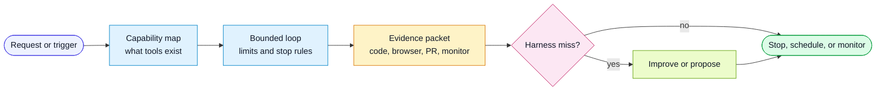

# Agent Tooling Playbook

The harness is agent-tool neutral, but it should take advantage of whatever
capabilities the chosen agent environment already provides.

The goal is not to standardize on one product. The goal is to map each available
capability into the same evidence-driven workflow.

## Flow

## Capability Map

| Capability | Use it for | Harness output |
|---|---|---|
| Code editing and terminal execution | Implement phases, run checks, inspect failures. | Phase report, verification result, run trace. |
| Repository search and diff tools | Gather scope, changed files, ownership, and affected surfaces. | PR Attention Packet, review findings. |
| Browser or UI automation | Verify real user flows, visual drift, responsive behavior, and accessibility. | QA Impact Packet, screenshots, visual coverage update. |
| Pull request and issue tools | Read review comments, post packets, gather labels, and link specs. | PR packet, QA brief, feedback event. |
| Background loops | Keep trying bounded repair or verification steps until a stop condition is met. | Loop trace, stop/repeat/escalate decision. |
| Scheduled runs | Run recurring audits, stale feedback sweeps, and signal-health checks. | Harness audit, proposed improvement, metrics trend. |
| Monitors or canaries | Watch deployed or long-running surfaces for regressions. | Trigger signal, incident-linked feedback event. |
| Sub-agents or roles | Split implementation, QA, review, debugging, and harness maintenance. | Role-specific reports and handoff notes. |
| Memory or knowledge capture | Preserve durable lessons after evidence proves recurrence. | Rule, workflow, template, eval, or project-doc update. |
| Proposed-patch mode | Prepare harness improvements for human approval when automation is risky. | Proposed patch plus verification plan. |

## Polished Workflow

The polished workflow should load the right task, gather context with available
tools, run a bounded loop, emit a structured packet, record the trace, and route
any harness miss into learning or self-improvement.

## Bounded Loops

Loops are powerful when they have explicit limits.

Every loop should define:

- goal
- evidence source
- allowed actions
- max attempts or time window
- stop condition
- escalation condition
- artifact to write when it stops

Examples:

- rerun a flaky visual check up to a fixed limit before escalating
- attempt small lint/test fixes until the same failure repeats
- monitor a PR for new review comments, then classify only new feedback
- watch weekly audit output and propose a harness patch when a threshold is met

## Scheduled Work

Scheduled work should focus on signals humans forget to check:

- weekly harness audit
- stale feedback events without outcomes
- specs marked ready but missing traceability
- recurring QA not-verified categories
- visual coverage gaps on touched UI surfaces
- PRs merged without attention or QA packets
- old proposed improvements that were never accepted or rejected
- primary-source-backed agent workflow changes worth a bounded experiment

The scheduled job should post a short packet, not a log dump.

For the canonical harness's daily external sensing loop, follow
`docs/ai-fsd/README.md`. Store the useful knowledge and decisions in the
repository; do not depend on a chat transcript or social feed remaining
available.

## Frontier Practices To Explore

These are intentionally experiments, not required gates:

- risk-first PR summaries that learn which files reviewers actually inspect
- QA packets that shrink or expand based on acceptance-criterion risk
- automatic eval generation from repeated human corrections
- proposed harness patches from weekly audit findings
- review comment clustering into reusable feedback categories
- browser-session replay as evidence for UI regressions
- signal budgets: limit packet length and force prioritization
- attention telemetry: ask humans which packet items were useful, then improve
  the packet shape

Promote an experiment only when evidence shows it improves signal quality or
reduces human effort.
