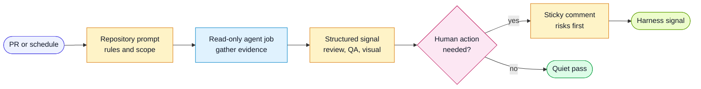

# AI GitHub Actions Patterns

This harness is agent-tool neutral. The CI patterns below describe the structure
of useful AI-assisted workflows without binding to one model provider.

## Flow



## Principles

- Keep the central prompt in the repository, not inside the workflow YAML.
- Scope permissions narrowly for each job.
- Use path filters to skip expensive AI review on irrelevant changes.
- Use concurrency groups so old review runs cancel on new pushes.
- Give the agent read-only tools by default.
- Require the agent to gather context before commenting.
- Ask the agent to edit one sticky summary comment instead of posting noisy
  repeated summaries.
- Treat CI gates as authoritative; AI comments explain and prioritize.
- Keep raw prompts, context, reviews and audit records private. Publish only
  selected, redacted findings with access controls and bounded retention; a
  private repository still has collaborators and downloadable artifacts.

The examples are opt-in adapters, not installed workflows. Audit and improvement
drafts remain in the runner workspace. QA jobs exchange minimal outcome records;
any adapter that sends repository data to a provider or retains artifacts needs
project-specific data handling before it is enabled.

## AI PR Review Job

The review job should:

1. Check out the pull request.
2. Gather PR metadata, diff, changed files, and linked specs.
3. Load the generic review prompt and project-local rules.
4. Review for scope drift, missing requirements, risk, tests, security, and
   release impact.
5. Post only high-confidence inline comments.
6. Post or update a concise summary comment with risks, evidence, and open
   questions.

Use `harness/templates/ai-pr-review-prompt.md` as the central prompt.

## QA Signal Aggregation Job

Individual jobs should emit small JSON artifacts rather than long prose:

```json
{
  "area": "visual",
  "status": "failed",
  "summary": "2 screenshot diffs",
  "artifacts": ["visual-report"]
}
```

A final QA brief job downloads those artifacts, combines them with acceptance
criteria traceability, and posts one sticky QA comment. This lets humans see the
whole risk picture without reading every job log.

## Visual Gate Job

For visual testing, use a bake period before making the gate required:

1. Start as advisory and post artifacts.
2. Add a coverage ledger so skipped screens are visible.
3. Add a baseline guard so new visual tests cannot merge without baselines.
4. Promote to required once the failure mode and maintenance cost are understood.

## Security Or Specialist Review

Specialist AI review jobs can run in parallel with the general PR review. Keep
their prompts narrower and their comments stricter. A security review should
focus on exploitable behavior, trust boundaries, secrets, authn/authz, injection,
dependency risk, and CI/CD permissions.

## Templates

Copy and adapt:

- `examples/ci/github-actions-ai-review.yml`
- `examples/ci/github-actions-qa-brief.yml`
- `examples/ci/github-actions-visual-gates.yml`
- `examples/ci/github-actions-triggered-improvement.yml`
- `harness/templates/qa-signal.schema.json`
- `harness/templates/ai-pr-review-prompt.md`
