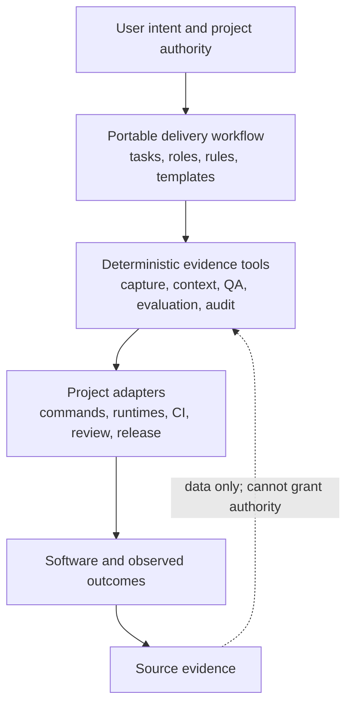
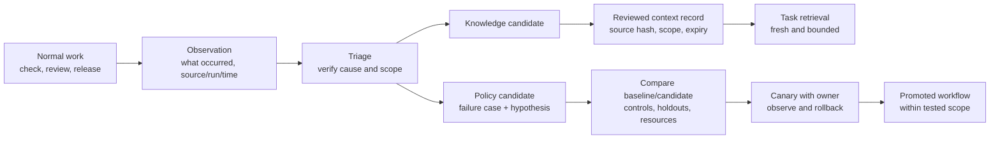
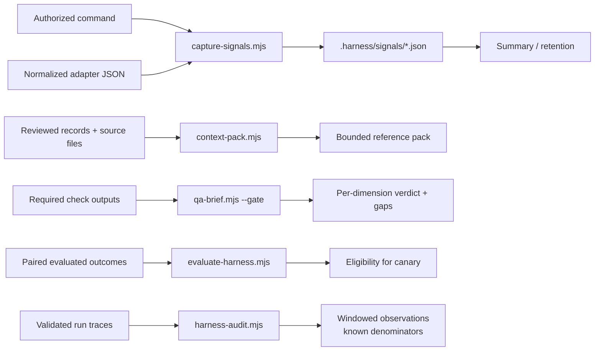

# Harness architecture

The harness connects intent to observable software outcomes. Its portable core
is a set of decisions and evidence contracts. Deterministic tools enforce the
parts that can be checked mechanically; project adapters connect those contracts
to actual development, runtime and release systems.

## Reading this architecture

A harness has two parts: instructions that guide the assistant's decisions, and
tools that check supplied evidence. The assistant or a project integration must
load and invoke them. The instructions can be used before any automated capture
or retrieval is wired.

Start with [Principles in practice](principles.md) for the reasoning and
[How to use the harness](getting-started.md) for task prompts and a worked
example. This page explains the boundaries behind those everyday steps; the
[tool reference](tool-reference.md) contains command details.

## Layers and authority

The top-level request and applicable host/project authority determine what may
happen. Retrieved pages, repository files, model proposals, context records and
source-system events are inputs to judge, not authority to expand permissions.
Keep interface, product, stack, provider and model-specific details in adapters.

Role prompts define responsibilities, not mandatory numbers of agents. One
coordinator owns integration and conclusions. Independent agents help when their
work can proceed without conflicting edits; a separate verifier is particularly
valuable for high-consequence behavior. More agents are not a quality metric.

## Observations, knowledge and policy

These stores answer different questions:

| Store | Question | Validation | Invalidating event |
|---|---|---|---|
| Source artifacts | What actually happened? | Check execution, persistent outcome, ownership and access | Artifact changed or claim disproved |
| Passive events | Which observations need attention? | Strict fields, identity, time, replay checks | Malformed/conflicting input; retention expiry |
| Working handoff | Where is this task now? | Current artifact identity, completed/open work and evidence | New work or relevant input change |
| Curated context | What fact/decision is useful for this scope? | Source hashes, timestamps, status and shared-key conflicts | Source change, age, expiry, supersession/retraction |
| Harness policy | What should future agents do? | Controlled comparison, regressions, canary outcomes | No benefit, new regressions, obsolete assumptions |

No summary, count or self-assessed confidence crosses these boundaries by itself.
Hashes establish byte identity, not truth. Event metadata is a producer claim,
not an attestation. Review the evidence before any consequential promotion.

## Evidence flows through executable tools

The tools intentionally do not execute an agent's stored text, authenticate
remote events, create a background service or connect to private accounts. Each
adopting project owns integration and can replace a Node adapter with its native
runtime while retaining the contracts and tests.

## Quality means several independent claims

Choose the relevant dimensions before observing results: correctness, boundary
compatibility, security/privacy, reliability/recovery, resource performance,
human usability, maintainability and operability. Each claim needs an oracle
and evidence appropriate to its risk. A unit pass cannot replace a real boundary
check; code coverage cannot establish meaningful assertions; a merge cannot
establish a healthy release.

The QA gate requires explicit required areas, an immutable tested revision,
run/attempt identity and evidence age. Missing, malformed, stale, conflicting,
skipped or unknown required evidence blocks. Reported failures remain failures.
Optional experimental signals can remain advisory, but cannot hide a reported
failure. The readable brief states both overall evidence completeness and the
required-area gate decision so those are not confused.

[AC tracing](../scripts/trace-acceptance-criteria.mjs) is a static navigation aid.
It can match comments or skipped tests. Treat linkage and executed behavioral
proof as separate evidence. Independent expected outcomes, safe counterexamples,
mutation and fault probes help expose tests that pass for the wrong reason.

## Learning has a measurable cost

Adopt the smallest change that prevents a demonstrated failure. Predeclare scope,
budget, independent graders and desired improvement; compare frozen versions on
motivating, regression and held-out tasks. Preserve every trial, uncertainty,
invariants and false positives. The supplied eligibility checker cannot infer
whether an agent followed instructions; an actual paired execution must test that.

After a promising comparison, observe a limited project canary. Measure accepted
delivery time, human review/repair, reopened work, escaped defects, recovery,
flaky-check burden and useful completion per cost. Record windows and denominators;
separate different task mixes and executor versions. Remove redundant rules when
they add attention or token cost without preserving meaningful behavior.

The [research evaluation](research-workflow-evaluation.md) separates official
practice from empirical findings and local inference. OpenAI's
[agent evaluation guidance](https://developers.openai.com/api/docs/guides/agent-evals)
and [trace grading guidance](https://developers.openai.com/api/docs/guides/trace-grading)
also distinguish outcome evaluation from diagnosing workflow execution. These
sources support testing the architecture, not a claim of universal superiority.

## Adoption and limits

Start with one meaningful project change, a few known risks and curated facts,
then wire normal checks. Verify capture failures, stale evidence, context changes
and false alarms before expanding. Add specialized skills only when an isolated
comparison demonstrates marginal benefit.

Implemented here: deterministic local mechanics and documented lifecycle rules.
Not established here: production quality, acceleration, runtime hook coverage,
agent instruction adherence or multi-executor portability. Those are outcomes
of adoption and testing, not properties a template can promise.
