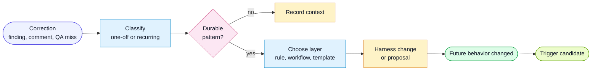

# Learning From Conversation Signal

Conversation is not just context. It is a source of calibration data.

When a human corrects an agent, the correction may be:

- a one-off product decision
- a missing requirement
- a scope boundary
- a repeated harness failure
- a deterministic check that should become automation

The harness should classify the signal instead of treating every correction as
temporary chat state.

The long-term goal is for strong signals to trigger the improvement workflow
automatically, with humans reviewing higher-level decisions rather than manually
assembling the same context every time.

## Flow



## Signal Sources

### Agent Self-Detection

During review or QA, an agent notices a pattern the harness already knows how to
classify.

Example: a test file references `AC3` but has no `@spec` anchor.

### Human Correction

A human says something like:

```text
We keep missing negative permission tests.
```

The learn workflow turns that into a rule, role checklist item, template field,
hook candidate, or eval case.

### Review Or QA Packet

The PR Attention Packet or QA Impact Packet surfaces a gap in a dedicated
"Harness Feedback" section.

The reviewer can then route the gap to the learn workflow.

## Feedback Categories

Use these categories consistently:

| Category | Meaning |
|---|---|
| `missed-risk` | The agent failed to surface important risk or blast radius. |
| `bad-scope` | The agent went beyond or short of the intended scope. |
| `missing-evidence` | The agent claimed confidence without proof. |
| `bad-summary` | The output was too vague, too long, or misprioritized. |
| `bad-test-plan` | The plan missed important positive, negative, edge, or regression tests. |
| `design-drift` | UI output drifted from design, accessibility, or responsive expectations. |
| `rule-gap` | A recurring issue is not covered by existing rules. |
| `hook-candidate` | A deterministic issue should become a script, hook, or CI gate. |
| `eval-candidate` | A judgment issue should become part of an agent eval. |
| `trigger-candidate` | A recurring signal is strong enough to start the improvement loop automatically. |

## Target Layer Selection

Choose the lowest layer that will prevent future misses:

| Target | Use when |
|---|---|
| Rule | A constraint applies whenever a layer is touched. |
| Role prompt | A role is missing a responsibility. |
| Workflow prompt | The sequence of work is wrong. |
| Template | A report lacks a field. |
| Script or hook | The check can be deterministic. |
| Eval | The issue requires judgment and should be replayed. |
| Project docs | The issue is local to one codebase. |

## Reporting Every Iteration

Every iteration should end with:

- what changed
- what was verified
- what was not verified
- open risks
- whether a harness feedback event was created

This lets humans see whether the harness is learning, not only whether a single
feature passed.
