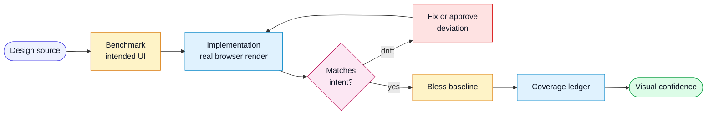

# Design And Visual Validation Workflow

Use this workflow when a feature changes user-facing UI and a design source
exists. Figma is the most common source, but the same pattern works with any
design file, screenshot, prototype, component library, or approved reference
image.

## Flow



## Two Different Artifacts

Do not confuse the design benchmark with the regression baseline.

| Artifact | Purpose | Owner |
|---|---|---|
| Design benchmark | The intended UI, exported from the design source. | Design or product source of truth. |
| Approved baseline | A screenshot of the implementation after it already passed design conformance. | Engineering test suite. |

The baseline must trace back to the benchmark. It is not just "whatever the app
rendered when snapshots were updated."

## Required Order

1. Capture the design benchmark.
2. Implement the UI.
3. Compare the rendered UI against the benchmark.
4. Document meaningful deviations.
5. Fix drift or get explicit approval for the deviation.
6. Bless the regression baseline only after conformance passes.
7. Use future visual regression checks to detect unintentional drift.

## Design References In Specs

Feature specs should include a design reference table when UI is in scope:

```markdown
## Design References

| Label | Source | Frame or Node | Local Artifact | Notes |
|---|---|---|---|---|
| example-feature-empty | Figma | 123:456 | specs/features/example-feature.design/example-feature-empty.png | Empty state |
```

The `Label` should also appear in the visual regression test or baseline name so
reviewers can connect benchmark to implementation evidence.

## Conformance Checklist

Check the rendered UI for:

- missing or extra sections
- incorrect hierarchy or emphasis
- broken spacing, alignment, or responsive behavior
- incorrect tokens, typography, icons, or interaction states
- clipped, overlapping, or unreadable text
- keyboard and screen-reader regressions
- accessibility-driven deviations from the design

Ignore sub-pixel noise unless the project requires pixel-perfect matching.

## Coverage Ledger

When a touched screen has no benchmark or no approved baseline, record it in a
visual coverage ledger. Do not skip silently.

Ledger statuses:

| Status | Meaning |
|---|---|
| `Covered` | Design benchmark and approved baseline exist. |
| `Pending` | UI changed, but a benchmark or baseline is missing. |
| `Provisional` | Baseline exists but needs follow-up confirmation. |
| `Exempt` | A named reason explains why visual coverage is not useful. |

## Baseline Rule

Never update a visual regression baseline just to silence a failing diff.

For intentional redesign:

1. Update or re-sync the design benchmark.
2. Re-run conformance review.
3. Record approved deviations.
4. Bless the new baseline.
