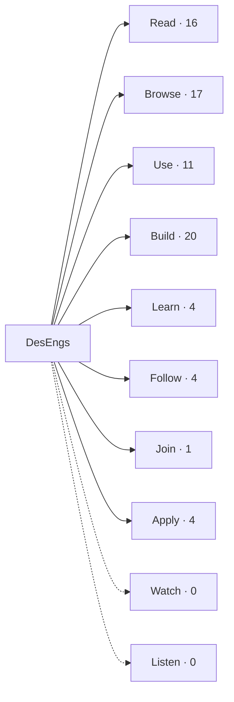
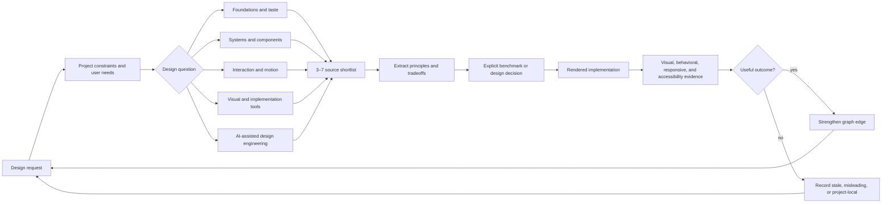

# Design Knowledge Graph

This graph connects discovery sources to design questions and delivery evidence.
Edges under **Observed graph** reflect DesEngs's published taxonomy. Edges under
**Derived graph** are local interpretation and should improve through project
feedback.

## Observed Graph

## Derived Delivery Graph

## Node Types

| Node | Meaning | Required metadata |
|---|---|---|
| Source hub | Curated directory such as DesEngs | URL, checked date, scope, authority |
| Resource | Article, gallery, tool, component, course, person, or community | URL, source hub, observed format |
| Theme | Local grouping such as motion or design systems | Definition and representative resources |
| Design question | A concrete decision the project needs to make | Product context and constraints |
| Artifact | Benchmark, design decision, spec reference, or implementation | Project path or stable link |
| Evidence | Rendered comparison, usability result, accessibility check, or delivery feedback | Date, method, outcome, gaps |

## Edge Types

- `listed-by`: resource appears in a source hub.
- `informs`: resource helps answer a theme or design question.
- `constrained-by`: a reference is bounded by product, platform, or accessibility
  requirements.
- `implemented-as`: a design decision becomes a project artifact.
- `verified-by`: a design or implementation is checked with evidence.
- `strengthened-by` / `weakened-by`: project results update confidence in a local
  relationship.

## Current High-Value Paths

| Question | Start with | Expected output |
|---|---|---|
| What should this interface emphasize? | Foundations and Taste | Hierarchy and principle notes |
| Is there an established component pattern? | Systems and Components | Comparative component references |
| How should state change feel? | Interaction and Motion | Motion intent, timing, and reduced-motion behavior |
| Which tool can help implement the idea? | Visual and Implementation Tools | Vetted implementation option and license check |
| Can an agent review or polish this UI? | AI-Assisted Design Engineering | Bounded experiment with human and accessibility review |

The graph is intentionally small. Add edges only when a design task demonstrates
that they help decisions or verification.
