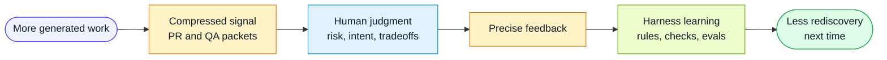

# Developer Attention Leverage

The harness exists to increase the amount of useful judgment a developer can
apply per minute of attention.

## Flow

## The Shift

Without agents, much developer attention goes to writing and inspecting code
line by line.

With agents, code volume increases and the scarce resource becomes judgment:

- Is this the right problem?
- Did the implementation preserve the invariant?
- Which behavior is riskiest?
- Which evidence is real?
- Which gap should become automation?
- Which recurring miss should change the harness?

The harness should move the review surface upward from raw code to structured
signals, while still letting humans drill down when needed.

## Bottleneck Relocation

AI often accelerates implementation before it accelerates the rest of the delivery
system.

That creates an uneven leverage problem:

- developers produce more code, tests, and summaries
- reviewers receive more diff surface
- QA receives more behavior to validate
- product and design receive more decisions to approve
- the bottleneck moves instead of disappearing

The harness should treat this as a system problem. Developer speed is only useful
when review, QA, product, design, and release workflows also get better signal.

## Test Independence

AI can write tests quickly, but tests written by the same implementation loop can
be tautological. They may prove that the code behaves as written, not that it
meets the requirement.

The harness should therefore emphasize:

- acceptance-criteria traceability
- negative and boundary cases for high-risk criteria
- independent QA packets before detailed verdicts
- mutation, fault-injection, browser, visual, or contract checks when available
- human judgment focused on risk, not raw test count

## High-Leverage Feedback

High-leverage feedback has three properties:

1. It points at a durable class of future behavior.
2. It is attached to evidence.
3. It can be routed to a harness layer.

Examples:

| Low leverage | Higher leverage |
|---|---|
| "This test is bad." | "This test would still pass if authorization were removed; add a rule that high-risk access criteria need negative tests." |
| "The PR summary is noisy." | "Reviewer focus should sort by blast radius before file count." |
| "QA missed this." | "The QA packet needs a field for unverified external dependencies." |

## Signal Surfaces

The current signal surfaces are experiments:

- PR Attention Packet: helps reviewers decide where to inspect first.
- QA Impact Packet: helps QA decide which risks and criteria need evidence.
- QA brief: compresses CI artifacts into one risk-first summary.
- Human Feedback Event: converts a correction into a durable harness change.
- Harness Audit: looks for recurring missing packets, weak signals, or stale
  feedback.

Keep improving these surfaces. If a surface is too long, too vague, or too hard
to act on, treat that as harness feedback.

## Design Principle

The best harness output lets a human give a useful signal without reconstructing
the whole task.

Every packet should answer:

- what changed
- what is risky
- what evidence exists
- what was not verified
- where human judgment is needed
- whether the harness should improve
