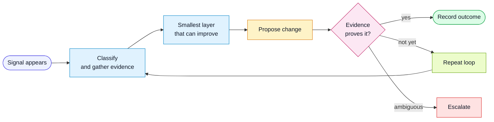

# Harness Goals

These goals describe the direction of the harness. They are intentionally higher
level than any one packet, prompt, script, or CI job.

## 1. Make Feedback Effortless

The harness should make useful feedback cheaper to give than vague feedback.

Good feedback loops should:

- capture signal as a byproduct of normal work
- avoid asking humans to re-explain context already present in the repo, CI, PR,
  spec, or test output
- turn repeated corrections into durable changes to tasks, workflows, roles,
  rules, templates, scripts, hooks, CI jobs, or evals
- prefer hard fact evidence over model self-report
- report whether the harness improved, not only whether the feature passed

The target state is not "people remember to run learn." The target state is:
when a reliable signal appears, the improvement loop starts with enough context
already assembled.

## 2. Improve From Hard Evidence

Harness instructions should be self-improving, but only from evidence.

Evidence can include:

- a failing deterministic check
- a high-risk acceptance criterion without coverage
- a repeated QA packet gap
- a PR attention packet that failed to surface the riskiest area
- a human correction attached to a concrete artifact
- a production issue linked back to a missing spec, test, rule, or review signal
- a review comment that maps to a repeatable harness miss

Avoid changing the harness from vibes alone. If the evidence is weak, create an
experiment or observation first, then promote it after recurrence or stronger
proof.

## 3. Move Developer Attention Upward

Agentic development changes where developer leverage comes from.

The harness should help the whole delivery system spend less attention on
line-by-line rediscovery and more attention on:

- intent and scope
- risk and blast radius
- acceptance criteria and residual gaps
- system invariants
- test quality and evidence quality
- product, design, security, and release tradeoffs
- improving the harness itself

If implementation gets faster but QA, review, product, design, or release do not,
the bottleneck simply moves. The harness should keep looking for leverage at the
new bottleneck, not only at code generation.

QA Impact Packets and PR Attention Packets are early experiments in this
direction. They are not the final form. Keep researching better ways to compress
work into high-signal surfaces that let humans steer the codebase with less
effort and more confidence.

## 4. Keep Exploring Signal Products

The harness should treat review and QA artifacts as signal products.

Useful signal products:

- are short enough to read before a diff
- sort the riskiest questions first
- connect back to specs and acceptance criteria
- show what was verified and what was not
- name the evidence source
- expose harness feedback candidates
- become more accurate as CI and repo evidence improves

Current experiments include:

- PR Attention Packet
- QA Impact Packet
- QA brief from CI signal artifacts
- harness run trace
- human feedback event
- weekly harness audit

Future experiments should be easy to add and easy to retire.

## 5. Become Trigger-Driven

The long-term direction is an open, trigger-driven improvement loop:

The loop should be conservative. It should not rewrite the harness endlessly or
promote weak guesses into rules. It should run when a signal is strong enough,
stop when evidence proves the goal is met, and ask for human judgment when the
goal requires product or team preference.

## 6. Use The Tools Already Available

The harness should exploit the agent environment instead of acting like a static
prompt.

If the tool can edit code, run commands, inspect diffs, control a browser, read a
pull request, run a bounded loop, schedule a recurring check, monitor a deployed
surface, or prepare a proposed patch, map that capability into the harness.

The rule is simple: every tool capability should produce evidence, a packet, a
trace, or a trigger. If it only produces chat, it is not yet part of the harness.
