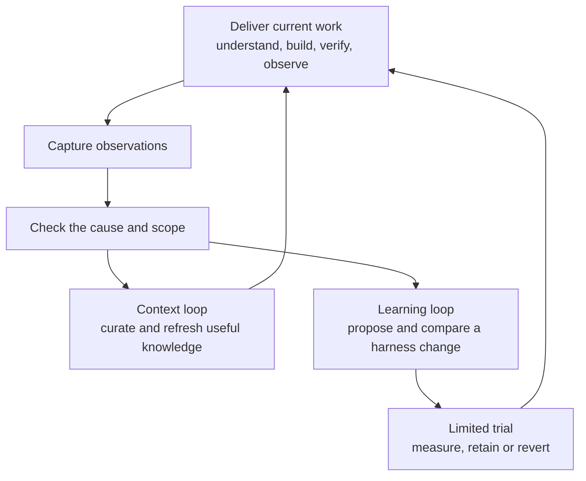

# Principles in practice

The harness should help an assistant make better decisions with less repeated
human work. Its value is useful software delivered with understandable evidence,
recoverable decisions and current project knowledge.

The same principles apply to discovery, design, implementation, review,
verification, release, maintenance and retirement. The amount of process changes
with the uncertainty and consequences of the task.

## 1. Start with an observable outcome

Describe what should become possible, what must remain true, and what is outside
scope. This gives the assistant a target and gives the reviewer a way to judge
completion. Acceptance criteria are those observable conditions, written so
someone can test or inspect them.

**In practice:** “Support cancellation” needs a defined result: when work is
cancelled, it stops within the agreed boundary and leaves a valid state. A code
change is useful only if it produces that behavior.

**Keep:** the outcome, constraints and acceptance criteria. For a small fix,
these can fit in the task record; a larger feature uses a spec.

## 2. Spend effort in proportion to risk

A local wording change, a new capability and an irreversible state change need
different levels of planning and verification. Ask what could go wrong, how far
it could spread, and how difficult recovery would be.

**In practice:** a small known fix may need one focused check. A change across
several boundaries needs a plan and integration evidence. A high-consequence
change needs negative cases, recovery evidence and independent scrutiny.

**Keep:** the important risks and the checks selected to address them. Avoid
creating documents or agents solely to complete a ritual.

## 3. Build in small increments with discriminating checks

A check is valuable when it can expose a plausible mistake. Choose the least
expensive check that exercises the relevant behavior, then add boundary or
system evidence for assumptions that smaller tests cannot establish.

**In practice:** test both normal completion and cancellation. Exercise a case
where cancellation arrives during a state change. Check the resulting state,
not merely whether a cancellation function was called.

**Keep:** the actual command or observation, result, checked artifact and any
unverified assumptions. Reuse still-valid evidence; recheck it after relevant
inputs change. Static test markers help locate coverage but do not execute it.

## 4. Treat quality as several explicit claims

Correctness, compatibility, security, recovery, performance, usability,
maintainability and operability answer different questions. Choose the applicable
ones before collecting results, and give required checks a clear expected outcome.

**In practice:** normal completion tests can pass while cancellation leaves
invalid state. The recovery claim is still unverified or failed. A combined
average would conceal the risk.

**Keep:** each required dimension's verdict and evidence. Missing, stale,
conflicting or skipped evidence remains visible. A reviewer checks the expected
outcome as well as the implementation; model agreement alone is weak evidence.

## 5. Preserve knowledge with a source and a scope

A useful context record captures a verified fact or accepted decision, where it
applies, and the source supporting it. It should become ineligible for reuse
when its source changes, it expires, or the decision is withdrawn.

**In practice:** “Cancellation preserves completed output” belongs in context
only after it is a verified requirement or accepted decision. If that contract
changes, the old record must be rechecked or superseded.

**Keep:** a concise claim, source, scope, verification time and expiry. Keep open
questions and next steps in a handoff. A preserved hypothesis is still a
hypothesis, and a matching file hash establishes unchanged bytes rather than truth.

## 6. Observe first, then explain

Passive feedback reduces the need for someone to rewrite events already recorded
by normal work. A command wrapper captures outcomes while checks execute; other
sources require configured adapters. Observation and explanation are distinct.

**In practice:** a check fails, then passes on retry. Preserve both attempts.
Investigate whether the implementation, input or environment changed before
calling the check flaky or weakening the gate.

**Keep:** minimal outcome metadata and an appropriate source reference. Raw
conversation, credentials and production payloads are not needed by default.
Absence of captured events says little without knowing collection coverage.

## 7. Improve the process through comparison

A recurring or severe miss may justify changing a rule, task, template, tool or
skill. Define what improvement would look like before editing. Compare the
existing workflow with the candidate on the motivating failure, safe cases,
regressions and held-out tasks that were not used to tune the change.

**In practice:** an instruction that makes one cancellation test pass is not
proven if ordinary completion now fails or review time doubles. Preserve required
behavior and compare useful outcomes, human effort, elapsed time and resource cost.

**Keep:** the hypothesis, versions, cases, results and rollback. A promising
candidate enters a limited real-project trial—a canary—before broader adoption.
Retain, simplify or remove it according to the measured result.

## How the three loops connect

A single source can inform both context and improvement, but each has its own
review. Delivery evidence establishes what happened; curated knowledge supports
future decisions; an evaluated policy changes how future work proceeds.

## What the human and assistant each own

| Responsibility | Human or project owner | Assistant |
|---|---|---|
| Intent | Sets desired outcome, priorities and constraints | Inspects the project and makes scope and uncertainty explicit |
| Decisions | Resolves consequential product tradeoffs and authority boundaries | Prepares concrete options and resolves routine choices from evidence |
| Delivery | Supplies access and any required domain judgment | Plans, implements, coordinates and verifies authorized work |
| Acceptance | Accepts relevant tradeoffs and authorizes consequential actions when required | Reports actual evidence and remaining risks; does not invent approval |
| Learning | Defines what improvement is worth and the permitted scope | Captures observations, curates verified context and evaluates candidates |

Authorization already given remains valid. The harness does not require the
human to approve every internal phase. The assistant should carry out authorized
work, surface decisions that need judgment, and keep enough evidence to make the
result reviewable.

## Recognize a useful result

At the end of a task, you should be able to answer: what improved, what proves it,
what remains uncertain, and what will make the next task easier? During adoption,
measure accepted delivery, review/repair effort and operational outcomes together.
The number of generated files, tests, agents or instructions is not the goal.

Continue with [How to use the harness](getting-started.md) for prompts and a
worked task, or [Architecture](architecture.md) for the implementation boundaries.
The [research evaluation](research-workflow-evaluation.md) records the evidence
and limitations behind these design choices.
