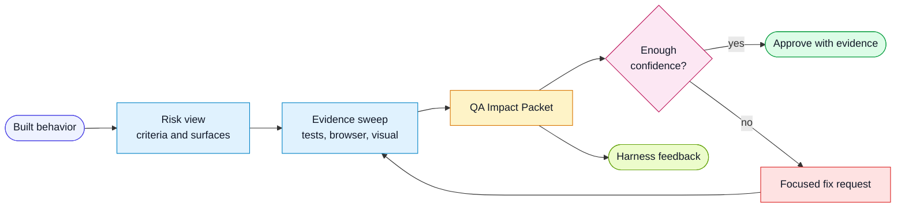

# QA And Feedback Loop

The harness treats QA as a judgment system, not a test-writing volume system.

AI can generate code and tests quickly. That does not prove the tests are useful.
The harness therefore asks a different question:

> Does the evidence cover the risky requirements?

## Flow

## QA Signals

Use multiple signals:

- acceptance-criteria traceability
- risk by acceptance criterion
- layer-specific tests
- browser or API verification
- visual and accessibility verification for UI changes
- mutation or fault-injection checks where available
- security and trust-boundary checks for risky changes
- human exploratory focus

No single metric is enough. Line coverage can be high while an important
requirement remains untested.

## Advanced Confidence Probes

Use heavier checks when risk justifies the cost. Good triggers include
authorization boundaries, data-loss paths, critical validation, release
rollback, complex state transitions, and regressions that tests previously
missed.

Examples:

- mutation probe: remove or invert the behavior a test claims to protect
- fault injection: make a dependency fail, timeout, duplicate, or return partial
  data
- negative permission test: prove one actor cannot access another actor's
  resource
- trust-boundary test: send malformed or malicious input through the real
  boundary
- scanner-backed check: run dependency, secret, or permission scans and record
  suppressions narrowly

The QA packet should record what probe ran, what it proved, and what remains
unverified.

QA outputs should also be signal sources for harness improvement. If QA repeats
the same not-verified item, has to infer the same missing risk, or keeps adding
the same manual focus area, that pattern should become a rule, template field,
script, CI signal, or eval candidate.

## QA Impact Packet

Every QA run should begin with a compact packet that answers:

- what changed
- which user flows are impacted
- which acceptance criteria are high-risk
- which criteria have tests
- what was not verified
- what a human should inspect first
- whether the harness missed something repeatable

The packet should appear before detailed criterion-by-criterion evidence.

## Feedback Event

When a human or agent notices a repeated miss, capture it as a feedback event.

Examples:

- review output hid the riskiest file
- QA manually inferred a missing edge case
- implementer skipped test traceability
- PR description omitted important non-verification
- UI verification skipped a viewport

The feedback event should name:

- source
- category
- severity
- expected harness behavior
- target layer
- outcome

Then update the smallest harness layer that prevents the miss next time.

## Inline Learning

Do not let feedback become chat history only.

The learning workflow should:

1. classify the signal
2. choose the target harness layer
3. edit the rule, role, workflow, template, hook, or eval
4. save a feedback event
5. report what changed

This closes the loop in the same session.
