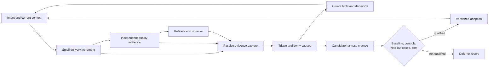

# Evaluating a production software development harness

The strongest defensible workflow is a small delivery loop with reliable
evidence, current project context, and a separately evaluated improvement loop.
No source reviewed establishes one universally best agent harness. This document
records what supports the design, what the current repository already provides,
and what still needs measurement in adopting projects.

Research was checked on 2026-09-05. Vendor names below identify sources, not
requirements for using the portable harness. Implementation details belong in
project adapters. See the [dated research record](ai-fsd/research/2026-09-05.md)
for provenance and verification.

## What the evidence establishes

| Source | Evidence type | Finding and practical limit |
|---|---|---|
| [DORA 2025](https://cloud.google.com/blog/products/ai-machine-learning/announcing-the-2025-dora-report) | Primary observational research summary | Nearly 5,000 survey respondents and qualitative research associate AI with higher throughput and product performance but lower delivery stability. Organizational practices matter. Association does not establish that a particular harness causes improvement. |
| [NIST SSDF 1.1](https://csrc.nist.gov/pubs/sp/800/218/final) | Published guidance, February 2022 | Security practices should span the development lifecycle, including prevention and response to discovered vulnerabilities. This supplies a portable completeness check, not a certificate or a measured agent-performance result. |
| [Anthropic context engineering](https://www.anthropic.com/engineering/effective-context-engineering-for-ai-agents) | Vendor engineering guidance, September 2025 | Select relevant context, retrieve details when needed, and preserve essential progress through structured notes. Notes can lose or retain incorrect facts; the article does not establish this repository's optimal context size or retrieval method. |
| [Anthropic agent evaluations](https://www.anthropic.com/engineering/demystifying-evals-for-ai-agents) | Vendor engineering guidance, January 2026 | Assess final outcomes as well as traces; separate capability tests from regression tests; use repeated trials and calibrated graders. A successful transcript or model judgment alone is insufficient evidence of correct persistent state. |
| [Google testing strategy](https://testing.googleblog.com/2021/06/how-much-testing-is-enough.html) | Practitioner guidance, June 2021 | Balance unit, integration, critical workflow, and relevant nonfunctional tests; improve strategy using field failures. Code coverage does not replace coverage of required behavior. The article supplies no universal test ratio or release threshold. |
| [Google postmortems](https://sre.google/sre-book/postmortem-culture/) and [error budget policy](https://sre.google/workbook/error-budget-policy/) | Practitioner guidance and an example policy | Use reviewed incident learning and explicit reliability objectives to direct engineering work. Product owners must choose meaningful indicators and thresholds; the example policy's numbers are not portable defaults. |
| [METR early-2025 experiment](https://metr.org/blog/2025-07-10-early-2025-ai-experienced-os-dev-study/) | Randomized study in a narrow setting | Sixteen experienced maintainers completed 246 tasks in familiar projects; AI access increased task time by 19%. This is evidence about those developers, tasks, and early-2025 tools, not present-day universal slowdown. |
| [METR February 2026 update](https://metr.org/blog/2026-02-24-uplift-update/) | Follow-up with disclosed validity problems | Selection effects and concurrent-agent time accounting made the new estimate unreliable. The authors consider acceleration plausible but cannot establish its size from that experiment. |
| [Three developer field experiments](https://www.microsoft.com/en-us/research/publication/the-effects-of-generative-ai-on-high-skilled-work-evidence-from-three-field-experiments-with-software-developers/) | Randomized field experiments, June 2025 publication | The pooled 4,867-developer analysis reports 26.08% more completed tasks, with standard error 10.3%. It studied code-completion assistance; task output is not the same outcome as long-term production reliability or autonomous-agent delivery. |
| [Superpowers repository](https://github.com/obra/superpowers/tree/b36e0829c6d0140e93cfef2ca599b1b07d4a7797) | Inspectable workflow source | The code and instructions demonstrate packaging and procedures. Repository popularity, tests existing upstream, and assertive workflow language do not prove marginal benefit in this harness. |

These studies use different populations, interventions, and outcomes. Combining
their percentages into an expected speedup would be misleading. The local
design inference is to evaluate useful completed work, review and repair effort,
and operational consequences together, with the model, tools, harness, task
mix, and observation window recorded.

## Build on the existing repository

The inspected baseline already had a spec-first workflow, acceptance-criteria
traceability, behavior-focused testing, risk-weighted QA and PR packets,
one-hypothesis debugging, research records, and verification against a rule
violation, a safe case, and unrelated work. These are foundations to preserve.

The gaps visible at the start of this upgrade were broader than missing prompt
advice: capture was mainly report-driven; durable context lacked a common
freshness and invalidation contract; and the outer loop lacked a standard
baseline/candidate comparison across held-out cases and delivery cost. Release
and operational learning were less explicit than implementation and QA. The
entrypoints and several rules also assumed web applications despite the stated
goal of portability.

The following is an engineering synthesis of the sources and this baseline,
not a claim that any source tested the complete design.

## Candidate decisions

`Adopt` means incorporate a bounded portable contract in this upgrade. It does
not mean production benefit has been measured. Confidence rates the justification
for testing the change; local effectiveness remains to be established. Costs
are relative engineering estimates, not measured timings.

| Candidate | Decision | Expected benefit / confidence | Portability and cost | Verification and rollback |
|---|---|---|---|---|
| Normalize evidence from existing command, CI, review, and release artifacts | Adopt | High / medium: less manual feedback entry | High; moderate adapter and privacy work | Test duplicate, malformed, conflicting, absent, and failed signals; disable an adapter without discarding source evidence |
| Keep observations, curated context, and policy changes separate | Adopt | High / high: prevents noisy evidence becoming instructions | High; low record-keeping cost | A failed check creates an observation, not a rule; trace every promotion to evidence; revert the promoted artifact |
| Track context source, scope, freshness, and supersession | Adopt | High / medium: fewer stale assumptions and lost handoffs | High; moderate curation cost | Change a cited source and verify stale context is rejected or refreshed; discard derived context and rebuild |
| Compare harness changes with a baseline, retained invariants, controls, and held-out tasks | Adopt contract; trial behavior | High / medium: detects overfitting and regressions | High; potentially substantial execution cost | Independent fixtures and graders; preserve failing runs; restore the prior harness revision on regression |
| Make quality dimensions and release evidence explicit | Adopt | High / high: exposes risks hidden by one green test suite | High; risk-dependent checks | Confirm missing evidence remains unknown; exercise negative behavior and release recovery when applicable |
| Connect delivery outcomes and incident learning to improvement | Adopt contract; project trial | High / medium: directs effort toward user impact | High principles; project-owned measurement | Define denominator, window, and attribution limits; do not infer deployment health from a merge |
| Install an entire external workflow bundle | Reject for this upgrade | Unproven marginal benefit | Duplicate rules, extra context, hooks, permissions, maintenance | Revisit only after a concrete gap and isolated skill/no-skill comparison |
| Always use more agents, more context, or mandatory TDD for every change | Reject as a universal rule | Unsupported | Coordination, token, and test maintenance costs can exceed benefit | Choose by task risk and observed bottleneck; retain a simple execution path |
| Add a vector database or continuously self-edit rules | Defer retrieval infrastructure; reject ungated mutation | No demonstrated need here | New failure modes and upkeep | Start with searchable files; require retrieval evidence or a passing change evaluation before expansion |

## Passive capture and continuous context

Passive means deriving candidate observations from work already being done. It
does not mean recording every conversation or sending private artifacts to a
service. Capture the minimum necessary structured facts and artifact references;
scope readers, redact sensitive material, and define retention in the adopting
project. Do not store credentials, hidden reasoning, or raw customer payloads.

Useful signals include failed checks, failures followed by retries, accepted
review findings, reopened tasks, reverts, recovery actions, and reported context
conflicts. A retry is not automatically a flaky test, a revert is not automatically
a defect, and missing events are not zero failures. Preserve the original status,
time, producing system, relevant revision, and uncertainty. Count duplicates once
and keep enough provenance to investigate conflicting results.

Durable context should link to authoritative requirements, architecture
decisions, ownership, current constraints, and verified evidence. Working notes
also preserve open questions and the next step, but do not acquire authority by
surviving compaction. At a handoff or source change, resolve stale or conflicting
facts before dependent edits. Searchable records are sufficient until an actual
retrieval problem justifies more infrastructure.

## Quality and improvement evaluation

A local harness experiment needs an explicit target failure and cost boundary.
Freeze the baseline, candidate, tasks, runtime, and grader before comparison.
Use the original failure, a safe counterexample, unrelated work, and cases the
candidate author did not tune against. A suite used for tuning is no longer
held out. Keep critical invariants separate from aggregate scores so a gain in
style or speed cannot conceal broken authorization or data integrity.

Deterministic fixtures can verify parsing, state transitions, and gate behavior.
They cannot establish that agents follow a new instruction or that software
delivery improves. That requires executing representative tasks against both
harness versions, independent outcome checks, multiple trials when practical,
and explicit reporting of infrastructure failures and unrun cases. Compare
success, retained behavior, review noise, time, and cost; choose thresholds before
seeing the result. Large uncertainty warrants a limited trial, not a promotion
claim.

Quality analysis should distinguish requirement coverage, behavioral evidence,
security and privacy, reliability and recovery, performance, usability where
relevant, maintainability, and release readiness. Record applicability and
unknowns. Use the least expensive check that meaningfully exercises the risk;
passing tests, source inspection, human review, and runtime observation answer
different questions.

Measure accepted delivery with follow-up outcomes. Useful local measures include
elapsed time to accepted work, human review and repair time, reopened work,
escaped defects, recovery time, flaky-check burden, and useful completion per
unit cost. Give every rate a denominator and window. Keep developer experience
alongside operational evidence, avoid individual rankings, and avoid treating
these observational metrics as causal evidence of a harness improvement.

## External skill review

Inspected source: Superpowers commit
[`b36e0829c6d0140e93cfef2ca599b1b07d4a7797`](https://github.com/obra/superpowers/commit/b36e0829c6d0140e93cfef2ca599b1b07d4a7797),
committed 2026-08-12, with an [MIT license](https://github.com/obra/superpowers/blob/b36e0829c6d0140e93cfef2ca599b1b07d4a7797/LICENSE).
No upstream files, hooks, dependencies, or plugins were installed.

| Examined skill | Assessment | Local decision |
|---|---|---|
| [Systematic debugging](https://github.com/obra/superpowers/blob/b36e0829c6d0140e93cfef2ca599b1b07d4a7797/skills/systematic-debugging/SKILL.md) | Reproduction, boundary evidence, and one-variable experiments are useful. Most already exist in the debugger role. Platform-specific signing and environment-value logging examples do not belong in the portable core. | Retain the existing role; any future import must address a demonstrated gap and avoid sensitive logging. |
| [Verification before completion](https://github.com/obra/superpowers/blob/b36e0829c6d0140e93cfef2ca599b1b07d4a7797/skills/verification-before-completion/SKILL.md) | Mapping claims to actual check output is useful and already established here. Requiring a fresh complete command for every positive statement can waste work when evidence still matches unchanged artifacts. | Strengthen evidence provenance and invalidation where needed; defer a separate skill until a comparison shows benefit. |

Before any future import, record the upstream revision, license, trigger,
required tools, permissions, external communication, instruction overlap, owner,
and removal path. Compare the existing workflow against the proposed skill on
the same tasks. Source inspection qualifies a candidate for evaluation; it does
not make the skill proven. Retain required license notices if code or substantial
upstream text is later copied.

## What remains unproven

The research supports testing this architecture. It does not prove a universal
best workflow, autonomous production readiness, a particular number of agents,
or an expected percentage acceleration. Representative agent trials, real
project adoption, incident follow-up, and reliable time/cost measurement remain
necessary. An adapter described in documentation is not an active collector, and
a passing repository check is not production-outcome evidence.
