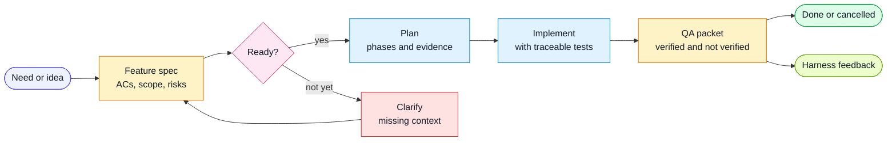

# Spec-Driven Process

The spec is the contract between the human, the agent, and QA.

The process exists to prevent a common failure mode in agentic development:
agents build plausible software that matches the conversation but not the
requirement.

## Lifecycle



## Feature Spec Requirements

A feature spec should include:

- context and user outcome
- acceptance criteria with stable `ACn` ids
- explicit out of scope
- affected surfaces
- data or API contract notes where relevant
- UI and design references where relevant
- test specification
- coverage checklist

## Acceptance Criteria

Acceptance criteria should be:

- stable: do not renumber after tests reference them
- positive: describe the desired end state
- testable: a verifier can prove pass or fail
- risk-tagged when needed: `(risk: high|medium|low)`

Example:

```markdown
- [ ] **AC1 - Authenticated users can save a draft.** Given a signed-in user
  with valid input, when they choose Save Draft, then the draft is persisted and
  can be reopened. (risk: medium)
```

## Test Traceability

Tests connect to specs using two conventions:

1. A test file declares the spec once:

```text
@spec save-draft
```

2. Each test references the acceptance criteria it covers:

```text
AC1
AC2
```

The trace script maps criteria to tests. High-risk untraced criteria block QA
approval unless the spec explicitly accepts that risk.

## Plan Before Code

Before implementation, produce a plan with:

- phases
- exact files expected to change
- tests that ship with each phase
- commands to run
- risks and open decisions

The plan is not a bureaucracy layer. It is how the agent proves it understands
the system before changing it.

## Done Means Verified

A feature is done only when:

- every acceptance criterion is verified, deviated, or explicitly accepted
- tests that cover the changed behavior pass
- the QA Impact Packet records residual risk
- the spec status and checklist are updated
- any harness miss is captured as a feedback event
