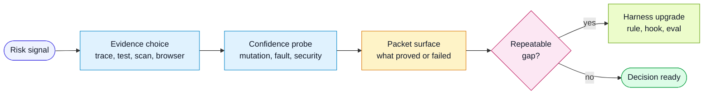

# Technical Highlights

The harness is more than a prompt pack. It is a set of technical practices that
make agent-assisted delivery easier to trust.

These practices are deliberately tool-neutral. Each target project can map them
to its own test runner, security scanner, browser automation tool, CI provider,
or agent environment.

## Flow

## Acceptance-Criteria Traceability

Tests are tied back to stable `ACn` identifiers. This gives QA and reviewers a
fast way to see whether the risky requirements have evidence.

Why it matters:

- catches requirements that have no test at all
- prevents broad "tests passed" claims from hiding unverified criteria
- lets CI produce a risk-first QA brief
- creates hard evidence for harness improvement

## Mutation And Fault Injection

Generated tests can be tautological. A mutation or fault-injection probe asks:

> Would this test still pass if the important behavior were broken?

Use these checks selectively for high-risk criteria, security boundaries,
financial or data-loss paths, complex branching, and bug fixes where the missing
assertion is easy to imagine.

Examples of useful probes:

- remove an authorization check and confirm a negative test fails
- invert a validation branch and confirm validation tests fail
- return an empty or partial dependency response and confirm graceful handling
- delay, duplicate, or reorder an async event and confirm idempotency
- corrupt a contract field and confirm the boundary rejects it

The harness does not require one mutation-testing tool. It requires the packet to
record whether the probe was run, what changed, what failed, and what residual
risk remains.

## Security By Evidence

Security review is treated as evidence work, not a ceremonial checklist.

Every risky change should identify:

- trust boundaries crossed by the change
- authentication and authorization assumptions
- sensitive data touched, stored, logged, or returned
- untrusted input and output rendering paths
- secret, token, and credential exposure risk
- dependency, build, and CI permission changes
- abuse, enumeration, and rate-limit considerations

The strongest security evidence is behavioral:

- negative permission tests
- injection and escaping tests at real boundaries
- scanner results with narrow, justified suppressions
- least-privilege CI and deployment permissions
- secrets scans on diffs and generated artifacts
- review findings tied to changed lines and exploitability

## Visual And Accessibility Conformance

UI quality is verified against a design source when one exists. The harness keeps
the intended design benchmark separate from the approved regression baseline.

Accessibility is not a final polish pass. It is part of the evidence matrix for
user-facing changes: keyboard behavior, accessible names, focus states,
responsive fit, readable text, and screen-reader structure are all QA signals.

## Risk-First Packets

PR Attention Packets and QA Impact Packets exist to compress review work into
human-usable signal.

Good packets:

- sort by risk instead of chronology
- name what was verified and not verified
- point reviewers to the highest-value files or flows
- distinguish deterministic evidence from judgment
- expose harness feedback candidates

This is the core leverage move: humans steer the system from high-signal
surfaces instead of reconstructing the whole task from raw diff and logs.

## CI Signal Aggregation

Individual jobs should emit small structured facts. A final brief combines those
facts into a single risk-first comment or report.

Useful signal areas include:

- traceability
- unit, integration, and end-to-end tests
- mutation or fault-injection probes
- security and dependency scans
- visual and accessibility checks
- release, migration, and rollback checks

The QA brief should not replace CI gates. It should explain what the gates mean
and where human judgment is still needed.

## Self-Improving Harness

When a technical practice reveals the same gap repeatedly, the harness should
change.

Promote repeated findings into the smallest durable layer:

- rule when the constraint is always true
- template field when reports omit the same signal
- script or hook when the check is deterministic
- CI gate when the signal is stable enough to block
- eval when the behavior requires judgment
- project-local rule when it is not generally reusable

The important pattern is evidence first, improvement second, then verification
that the improvement would have caught the original miss.
