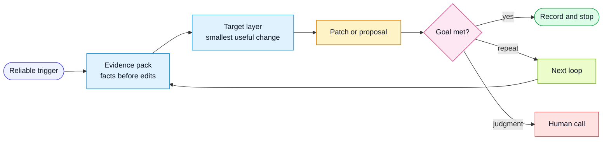

# Triggered Self-Improvement

Triggered self-improvement is the research direction for making the harness more
effortless.

The idea: when a reliable signal appears, the harness should gather evidence and
run the improvement workflow automatically, or prepare the smallest safe patch
for human approval.

## Flow

## Trigger Sources

Potential triggers:

- failed traceability gate
- high-risk untraced acceptance criterion
- repeated not-verified item in QA packets
- missing PR Attention Packet on a meaningful change
- missing QA Impact Packet for a risky change
- malformed or incomplete run trace
- recurring review comment category
- visual coverage gap on a touched UI surface
- accessibility finding without a matching rule or test
- human feedback event marked for promotion
- weekly audit finding above threshold
- scheduled tool-assisted sweep finds a repeated signal
- scheduled external research finds a primary-source-backed workflow improvement
- monitor or canary produces an incident-linked signal

## Evidence Requirements

A trigger should include or gather:

- source artifact
- timestamp or run id
- spec or PR reference
- category
- affected harness layer
- expected future behavior
- verification method

If the loop cannot gather evidence, it should create an observation rather than
changing the harness.

External research signals enter through
`harness/workflows/continuous-research-improvement.md`. A social post, bookmark,
or vendor announcement is a discovery signal, not sufficient change evidence on
its own. The research loop must link it to a primary source or a reproducible
experiment before promoting a harness change.

## Loop Shape

The loop should feel automatic from the outside and conservative on the inside:
collect evidence first, change the smallest useful layer, verify against the
trigger, then stop, repeat, or escalate.

## Stop Conditions

Stop when:

- the deterministic check passes
- the target packet field is present and populated
- the rule or workflow now covers the observed miss
- an eval case reproduces the miss and then passes
- a human approves the proposed harness change
- the signal is too ambiguous and needs human judgment

## Research Questions

- Which signals are strong enough to trigger automatic harness edits?
- Which signals should only create proposed patches?
- How much evidence is enough before a rule changes?
- How should the loop avoid overfitting to one feature?
- Which packet fields are worth keeping, merging, or deleting?
- Can CI-generated QA briefs become accurate enough to be the default QA entry
  point?
- Can PR review summaries reliably predict where human reviewers spend useful
  attention?
