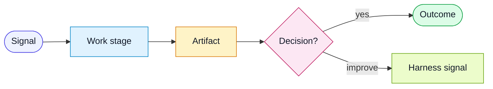

# Workflow Diagram Style

Workflow diagrams are communication surfaces. They should help adopters
understand the shape of the workflow before reading the details.

## Diagram Goals

- Show the story of the workflow, not every implementation step.
- Keep labels short and human-facing.
- Use consistent colors for similar concepts.
- Make the feedback or improvement path visible.
- Prefer five to eight nodes over a dense trace.

## Suggested Color Roles

Use these roles consistently:

| Role | Meaning |
|---|---|
| `signal` | Request, trigger, diff, or input signal. |
| `work` | Context gathering, judgment, or active work. |
| `artifact` | Packet, report, plan, evidence, or durable output. |
| `decision` | Approval, conformance, confidence, or routing decision. |
| `outcome` | Completed workflow state. |
| `improve` | Harness learning, trigger, or improvement path. |
| `learn` | Repair, escalation, or human judgment path. |

## Pattern

If a diagram needs more detail, put the detail in the workflow steps instead of
adding more nodes.
