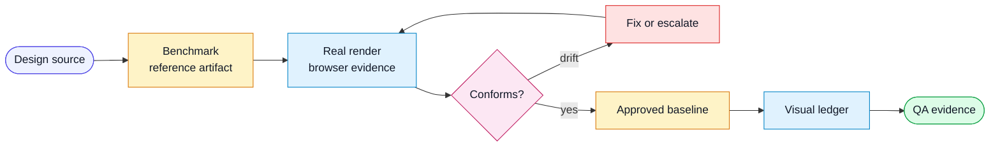

# Workflow: Design Visual Validation

Use this workflow when implementation must match an external visual design
source such as Figma, a prototype, a screenshot, or a component library example.

## Flow

## Inputs

- feature spec with `## Design References`
- local design benchmark artifacts, or credentials/tooling to export them
- URL or route where the implementation can be rendered
- viewport matrix
- accessibility requirements

## Steps

1. Confirm design references.
   - If references are missing, ask for them or create a `Pending` ledger row.
   - If references changed, re-sync the benchmark before judging drift.
2. Capture or refresh benchmark artifacts.
   - Save files under the project-local design artifact path.
   - Update the manifest with source IDs, labels, export time, and notes.
3. Render the implementation.
   - Use a real browser when possible.
   - Capture screenshots for each required state and viewport.
4. Compare benchmark to render.
   - Prioritize layout, content, hierarchy, tokens, states, and responsive fit.
   - Record accessibility-driven deviations as allowed differences.
5. Fix or escalate drift.
   - Fix unintentional implementation drift.
   - Escalate design ambiguity or impossible constraints.
6. Bless visual regression baselines only after conformance passes.
7. Update the visual coverage ledger.
8. Report evidence in the QA Impact Packet.

## Output

- design reference manifest
- screenshots or visual report
- updated visual coverage ledger
- QA packet entries for conformance, deviations, and residual risk

## Done Criteria

- each referenced design artifact has a matching implementation state or an
  explicit exception
- visual regression baselines trace to approved design benchmarks
- no baseline was updated solely to silence drift
- accessibility violations are fixed or explicitly risk-accepted
