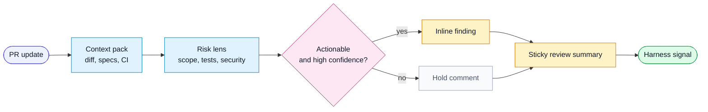

# Workflow: AI PR Review In CI

Use this workflow when a CI job asks an AI reviewer to inspect a pull request.

## Flow

## Inputs

- pull request metadata
- changed files and diff
- linked specs, plans, or tickets
- project-local rules
- generic harness review rules
- central AI review prompt

## Steps

1. Gather context with repository tools.
   - PR title, body, labels, base branch, and changed files.
   - Linked specs and acceptance criteria.
   - CI status if available.
2. Infer intended scope.
3. Compare scope to diff.
   - flag scope creep
   - flag missing expected changes
   - flag unrelated churn
4. Review by risk layer.
   - correctness and edge cases
   - data/API contract impact
   - UI, accessibility, and visual impact
   - security and privacy boundaries
   - test and traceability coverage
   - release and migration risk
5. Run an adversarial self-check.
   - what would make this review wrong
   - what evidence is missing
   - which comments are low confidence and should be omitted
6. Post comments.
   - inline only for actionable, high-confidence findings
   - one sticky summary for risk, evidence, and open questions

## Output

- high-confidence inline findings
- summary comment
- optional harness feedback candidate

## Rules

- Do not ask for style-only churn unless a project rule requires it.
- Do not duplicate failing CI logs unless the agent adds prioritization.
- Do not claim a check passed unless the job evidence proves it.
- Prefer "not verified" over invented confidence.
