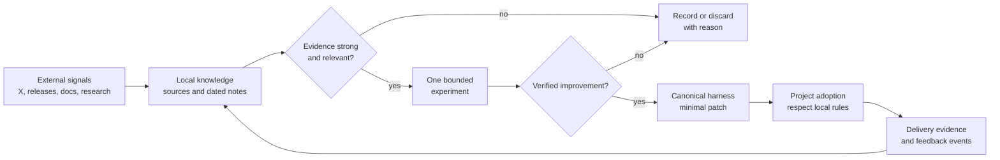

# Workflow: Continuous Research Improvement

Use this workflow to convert external AI-first software delivery signals into
small, verified improvements without turning the harness into a trend log.

## Goal

Continuously sense changes in agent workflows, test the most relevant idea, and
feed proven improvements through the canonical harness and its adopting
projects.

## Outer Loop

## Inputs

- connected X bookmarks and liked posts when available
- public X searches and curated accounts
- official product documentation, changelogs, release notes, and engineering
  blogs
- standards, research papers, repositories, and credible practitioner reports
- existing research notes and application ledger
- delivery evidence and feedback events from adopting projects

## Daily Bounds

- Review only material newer than the last recorded check unless backfilling an
  important source.
- Prefer primary sources. Treat social posts as discovery signals until a
  primary source or reproduction supports the claim.
- For routine scheduled research, select at most one experiment per run. An explicit broader user improvement request may contain several independently scoped and verified changes.
- Keep the experiment reversible and small enough to verify in the same run.
- Do not rewrite broad harness surfaces from a single announcement or opinion.
- Do not mutate adopting projects during the research run.
- Teach one useful concept in every run, including when no harness change
  qualifies.
- Stop after recording the outcome and verification, including when no signal
  qualifies.

## Steps

1. Establish the baseline.
   - Read the last dated research note and application ledger.
   - Inspect repository status and preserve unrelated work.
   - Identify the last-checked timestamp for each source family.
2. Gather signals.
   - Query connected X bookmarks and likes first when available.
   - Keep private collection contents, account activity and execution metadata in
     private evidence. Shared notes contain public citations and redacted lessons.
   - Search curated X accounts and the broader web.
   - Check official OpenAI/Codex, Anthropic/Claude, Apple/Xcode, GitHub, and other
     curated release sources.
   - Add promising sources to `docs/ai-fsd/sources.md` with authority and cadence.
3. Normalize and deduplicate.
   - Record source, publication date, observation date, claim, affected harness
     layer, and whether the item is new.
   - Link reposts and commentary to the underlying source.
4. Grade the evidence.
   - `primary`: official documentation, release note, code, standard, or paper.
   - `corroborated`: multiple independent credible sources or a local reproduction.
   - `discovery`: bookmark, social post, opinion, demo, or unverified report.
   - Reject marketing claims that lack enough detail to test.
5. Rank candidates.
   - Score expected delivery impact, confidence, applicability across projects,
     verification cost, reversibility, and risk.
   - Prefer an idea that addresses observed project feedback over a fashionable
     capability with no delivery problem.
6. Decide.
   - Choose one bounded experiment, record an observation for later, or record
     `No qualified change today` with the failed threshold.
7. Experiment and verify.
   - Define the current behavior, expected improvement, measurement, allowed
     files, and rollback.
   - Use `signal-triggered-improvement.md` for the patch.
   - Run focused tests plus the repository's deterministic harness checks.
8. Preserve knowledge.
   - Write `docs/ai-fsd/research/YYYY-MM-DD.md` from the research template.
   - Update the application ledger with applied, rejected, deferred, or reverted.
   - Keep claims, inference, and not-verified items distinct.
9. Teach the concept.
   - Write a short introduction article in plain language about the strongest
     useful concept from the run.
   - Explain the mental model, why it matters, what was applied or deliberately
     not applied, a before-and-after example, how to use it in another project,
     and its limits or failure modes.
   - End with three to five questions that mix recall with an application
     scenario. Put the answer key after the questions so the reader can attempt
     the quiz first.
   - If no idea is new enough to teach, revisit a foundational concept using a
     new example rather than inventing novelty.
10. Route the outer feedback loop.
   - Publish generic, proven behavior in this canonical harness.
   - Let each adopting project select relevant components and retain its local
     rules, constraints, and evidence.
   - Bring repeated project misses back as feedback events; promote only when the
     evidence supports a generic change.

## Promotion Threshold

A signal may change the canonical harness only when all are true:

- it maps to a concrete delivery problem or measurable opportunity
- the source is primary or the behavior is reproduced locally
- the change is generic rather than product-specific
- a verification method and rollback path exist
- the expected benefit exceeds the instruction, maintenance, and adoption cost

Otherwise, record it as deferred, rejected, or project-local.

## Report

- sources checked and source failures
- strongest new signals
- experiment or no-change decision
- files changed and verification results
- plain-language learning article and knowledge-check questions
- ledger and feedback-event updates
- recommended project adoptions
- not-verified items and next watchlist

## Skill and outcome evaluation

Use `evaluate-improvement.md` for new workflow or skill adoption. Record source
revision, license, overlap and required authority before integration. Maintain
source confidence separately from measured local effectiveness.
