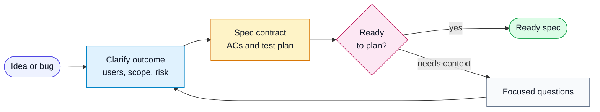

# Workflow: Define Spec

Use this workflow when a user wants to turn an idea, rough notes, bug request, or
feature request into a feature spec.

## Goal

Produce a complete feature spec with stable acceptance criteria and a test
specification. Do not implement code in this workflow.

## Flow

## Inputs

- user request or draft
- existing specs
- epics or roadmap notes
- architecture decisions
- project-local rules

## Steps

1. Find adjacent or overlapping specs.
2. Extract the problem, users, scope, affected surfaces, edge cases, and risks.
3. Choose draft mode or interview mode:
   - Draft mode: user provided enough context; fill the spec and label
     assumptions.
   - Interview mode: ask focused questions by section.
4. Write positive, testable acceptance criteria with stable `ACn` ids.
5. Mark high-risk criteria explicitly when the heuristic may be wrong.
6. Add a test specification that maps behaviors to layers.
7. Save the spec using `harness/templates/feature-spec.md`.
8. Reconcile with existing specs:
   - duplicate
   - obsolete
   - overlapping
   - wrong epic or parent
9. Ask for confirmation before deleting or repointing existing specs.

## Output

- new or updated feature spec
- assumptions list
- reconciliation results
- readiness recommendation: keep `draft` or mark `ready`

## Reporting

Report:

- spec path
- assumptions made
- open questions
- overlaps found
- whether the spec is ready for planning
