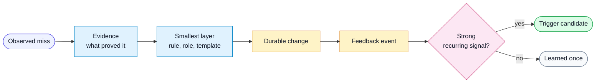

# Workflow: Harness Feedback Loop

Use this workflow when a human correction, QA finding, review miss, or agent
self-detection suggests the harness should improve.

## Flow

## Inputs

- the conversation or report that exposed the miss
- the work artifact involved: spec, plan, code, review, QA packet, or PR packet
- the expected behavior next time
- any project-local constraints that should not become generic rules

## Steps

1. Classify the signal.
   - `missed-risk`
   - `bad-scope`
   - `missing-evidence`
   - `bad-summary`
   - `bad-test-plan`
   - `design-drift`
   - `rule-gap`
   - `hook-candidate`
   - `eval-candidate`
2. Decide whether it is generic or project-local.
3. Choose the smallest target layer that prevents recurrence:
   - rule
   - role
   - workflow
   - task
   - template
   - script or hook
   - CI gate
   - eval
   - project docs
4. Apply the harness change in the same iteration when safe.
5. Save a feedback event using `harness/templates/human-feedback-event.md`.
6. Report:
   - signal source
   - target layer
   - files changed
   - verification performed
   - residual risk
   - whether this should become an automatic trigger

## Guardrails

- Do not turn one-off product decisions into generic harness rules.
- Do not add broad process when a template field or script check would solve the
  miss.
- Prefer deterministic checks over prompt reminders when the condition can be
  parsed or tested.
- Update the neutral task, workflow, rule, template, or script first. Keep
  project-local presentation details outside the core harness.
