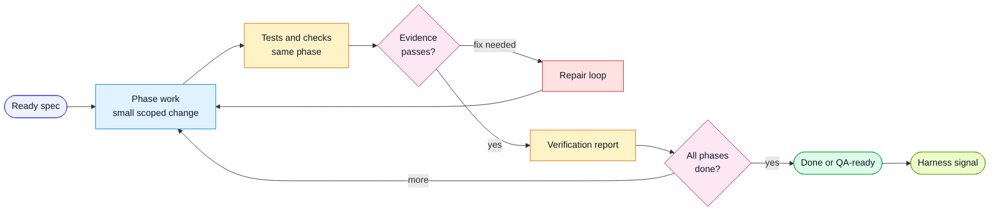

# Workflow: Implement Spec

Use this workflow when the user approves a plan or asks to build a ready spec.

## Goal

Implement the feature in small phases, ship tests with behavior changes, verify
acceptance criteria, and report every iteration.

## Flow

## Inputs

- feature spec
- implementation plan
- generic rules
- project-local rules
- test traceability conventions
- authoritative references for the affected capability

## Steps

1. Confirm the spec is `ready` or `in-progress`.
2. Read the plan. If no plan exists, create one first.
3. Set the spec to `in-progress`.
4. For each phase:
   - report the phase starting
   - inspect existing patterns before editing
   - implement only the approved scope
   - write or update tests in the same phase
   - add `@spec <slug>` and `ACn` references to tests that cover the spec
   - run the phase verification commands
   - report files changed, tests changed, commands run, and open gaps
5. Verify project-specific qualities (interaction, compatibility, performance or recovery) where the affected capability requires them. Record missing coverage explicitly.
6. After all phases, run final verification:
   - test commands for affected layers
   - lint or static checks
   - acceptance-criteria traceability
   - observed behavior at the real affected boundary where relevant
7. Append a verification report to the spec.
8. If all criteria pass, update the spec to `done`.
9. If a repeated harness miss appears, run the learn workflow.

## Reporting Every Iteration

Every phase report should include:

- phase name
- files changed
- tests added or updated
- commands run and results
- acceptance criteria advanced
- blockers or not-verified items
- harness feedback found or not found

## Rules

- Do not expand scope silently.
- Do not mark a criterion verified without evidence.
- Do not defer tests for new behavior to a later phase.
- Do not update snapshots, baselines, fixtures, or generated outputs only to hide
  a failing check.
