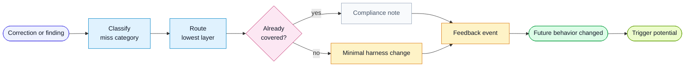

# Workflow: Learn

Use this workflow when a human correction, review finding, QA finding, or agent
self-detection should improve future harness behavior.

## Goal

Convert an observed harness miss into a durable rule, role prompt, workflow
change, template field, hook candidate, eval candidate, or signal trigger.

## Flow

## Inputs

- lesson description
- recent review or QA output
- relevant harness files
- project-local rules if the lesson is project-specific

## Steps

1. State the observed signal.
2. Classify the feedback category:
   - `missed-risk`
   - `bad-scope`
   - `missing-evidence`
   - `bad-summary`
   - `bad-test-plan`
   - `design-drift`
   - `rule-gap`
   - `hook-candidate`
   - `eval-candidate`
3. Choose the lowest target layer:
   - rule
   - role prompt
   - workflow prompt
   - template
   - script or hook
   - eval case
   - project documentation
   - signal trigger
4. Check whether an existing rule already covers it.
5. Write the minimal durable change.
6. Save a Human Feedback Event using the template.
7. Report category, target, change, event path, when it will apply, and whether
   the signal should trigger future loops.

## Rules

- Apply small changes. Do not rewrite a whole prompt for one lesson.
- If the issue is deterministic, mark it as a hook candidate.
- If the issue requires judgment, mark it as an eval candidate.
- If the lesson is project-specific, put it in the project layer.
