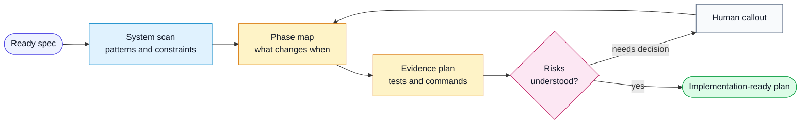

# Workflow: Plan Spec

Use this workflow after a feature spec is ready and before implementation.

## Goal

Create a phase-by-phase implementation plan that names files, tests, commands,
risks, and decision points.

## Flow

## Inputs

- feature spec
- existing project structure
- architecture decisions
- project-local rules
- relevant open technical debt or known issues

## Steps

1. Locate and read the feature spec completely.
2. Read the relevant generic and project-local rules.
3. Inspect the existing codebase for patterns in the affected surfaces.
4. Identify small phases around independently verifiable behavior:
   - clarify contracts and invariants
   - implement one complete capability
   - exercise affected boundaries and recovery
   - integrate and verify the outcome
   - prepare acceptance, release and operational evidence
5. Omit phases that do not apply.
6. For each phase, name:
   - files to create or modify
   - tests to write alongside the change
   - commands to run
   - dependencies and blockers
   - acceptance criteria affected
7. Call out risks and decisions that need human approval.
8. Save the plan using `harness/templates/implementation-plan.md`.

## Output

- implementation plan
- active/skipped phase list
- estimated file count
- risk and decision list

## Rules

- Do not write product code.
- Do not invent stack-specific commands; use project-local commands.
- Do not create vague test instructions. Name exact behavior to test.
