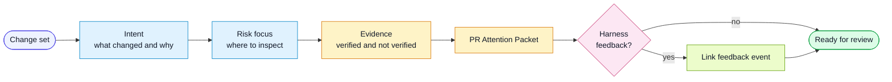

# Workflow: Pull Request

Use this workflow when preparing a pull request or equivalent change request.

## Goal

Create a concise review surface that tells humans what changed, where risk is,
what was verified, and what was not verified.

## Flow

## Inputs

- commit log
- diff stat
- linked spec
- QA report
- verification commands
- not-verified items

## Steps

1. Gather context:
   - branch name
   - commits since base
   - diff stat
   - linked spec
   - existing QA report
2. Infer change type:
   - feature
   - fix
   - refactor
   - docs
   - infrastructure
   - harness
3. Generate a title using the target repository's convention.
4. Fill the PR Attention Packet.
5. List validation evidence and not-verified items honestly.
6. Link the spec and QA packet.
7. Include a redacted feedback summary if a feedback event was created; keep raw
   local evidence private and do not link inaccessible private artifacts.
8. Review the staged publication set and relevant history for secrets, client
   information and private execution metadata before pushing.

## Output

Use `harness/templates/pr-attention-packet.md` inside the PR body.

## Rules

- Do not hide failed or skipped checks.
- Do not summarize every file when a risk-focused path is clearer.
- Do not create a PR if local uncommitted changes should be included but are not.
