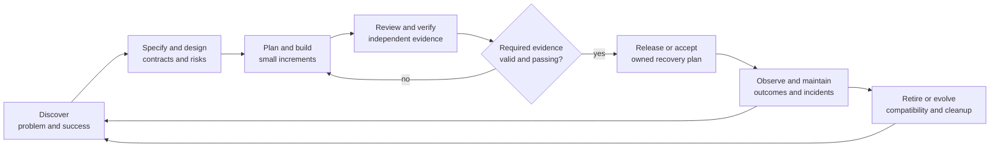

# Workflow: Production delivery

Use this as the lifecycle map. Load the detailed task only for the current step.
The project supplies domain rules, commands, environments and acceptance owners.

## Operating principles

1. Define useful outcomes and risks before choosing tools. Work in small complete increments.
2. Maintain a small current context, with source provenance and explicit unknowns.
3. Exercise behavior at real boundaries; keep independent verification proportional to risk.
4. Use deterministic gates for mechanical conditions and human judgment for product tradeoffs.
5. Observe accepted delivery and operational effects, not code volume or agent confidence.
6. Improve the harness like software: a hypothesis, controlled comparison, limited adoption and rollback.

## Proportional paths

| Path | Trigger | Minimum useful evidence |
|---|---|---|
| Small change | Clear scope, reversible, low uncertainty | Intent, affected behavior, focused check or reason no execution is needed, result |
| Feature | Multiple behaviors or boundaries | Ready spec, risk and evidence plan, small phases, independent review, QA packet |
| High consequence | Security, irreversible state, reliability or broad compatibility risk | Threat/failure analysis, negative and recovery probes, separate verifier, release observation and rollback limits |

These are decisions, not compulsory paperwork counts. Existing user authorization
remains valid; do not add approval rituals for routine work. A release or external
action follows the user's actual scope and the project's authority rules.

## Lifecycle responsibilities

| Stage | Agent contribution | Durable evidence / exit condition |
|---|---|---|
| Discover | Inspect users' problem, existing behavior and constraints; identify uncertainty | Outcome, non-goals, acceptance owner, assumptions |
| Specify | Write observable ACs; identify trust boundaries and failure modes | Ready spec or compact fix record with independent oracle |
| Design | Compare consequential alternatives, compatibility, recoverability and cost | Decision record for decisions worth revisiting |
| Plan | Split complete outcomes; select tests and capabilities; bound independent agents | Plan, ownership and required quality dimensions |
| Implement | Inspect patterns, make a small patch, test relevant behavior | Versioned artifacts, command outcomes, changed assumptions |
| Review | Check change against requirements and risks, without trusting the implementer's claims | Prioritized actionable findings, evidence and resolutions |
| Verify | Run behavioral, contract and nonfunctional checks; challenge weak tests | Same-artifact evidence, residual gaps, required dimensions pass |
| Release | Verify the artifact and configuration, compatibility, recovery and observation plan | Authorized acceptance/release, owner, indicators, rollback criteria |
| Operate | Inspect failures, regressions, support and reliability evidence | Source-linked observations; confirmed incident causes and action owners |
| Maintain/retire | Address dependencies, obsolete flags, data/contract retention and deprecation | Checked migration/cleanup and communicated remaining constraints |

## Risk-based quality analysis

Use `harness/templates/quality-policy.md` to select required areas before running
checks. A project's dimensions may include correctness, boundary compatibility,
security/privacy, resilience, performance/resource usage, human interaction,
maintainability and operability. Mark a dimension not applicable with a reason;
missing execution of an applicable check is not the same thing.

For every important risk, ask what observation could disprove the claim. Prefer
fast precise tests, then real integration evidence for assumptions crossing a
boundary. Use property or metamorphic checks for broad invariants, mutation to
check test sensitivity, and fault injection for recovery where useful. Do not
mandate a universal coverage percentage, test ratio or mutation score.

A separate reviewer should inspect critical behavior and the test oracle. Model
agreement is correlated evidence; independent tool execution and persistent-state
checks matter more. Freeze relevant inputs so new edits cannot reuse stale passes.
Quarantined flaky tests need an owner, expiry, impact and replacement evidence;
a successful retry does not erase the first failure.

## Context and feedback throughout

At start/resume, build relevant context with `continuous-context.md` and read the
sources needed for the task. After meaningful decisions, update the source and
curate only the durable fact. Handoffs keep open work separate from knowledge.

Use `passive-feedback.md` to gather outcomes from normal commands and adapters.
Triage severe or repeated evidence with `signal-triggered-improvement.md`.
Use `evaluate-improvement.md` before claiming a policy or skill improves delivery.
External ideas use `continuous-research-improvement.md`; a scheduled sweep is
bounded, while an explicit broader improvement request can contain several
independently verified changes.

## Exit report

State what changed, why, the actual checks and results, ACs verified/open,
not-verified items and the feedback event reference or reason none was created.
Separate implemented local mechanisms, documented integration contracts and
measured production outcomes.
