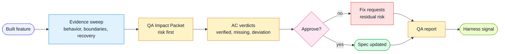

# Workflow: QA

Use this workflow after implementation and review when the user asks whether a
feature meets the spec.

## Goal

Verify every acceptance criterion with evidence and produce a QA Impact Packet
that focuses human attention on risk.

## Flow



## Inputs

- feature spec
- implementation diff
- test results
- traceability report
- authoritative references for relevant project quality dimensions
- security, mutation, or fault-injection results when risk calls for them
- project-local verification commands

## Steps

1. Locate and read the spec.
2. Run acceptance-criteria traceability:

```bash
node scripts/trace-acceptance-criteria.mjs --spec <slug>
```

3. Gather implementation context:
   - changed files
   - commits
   - test output
   - runtime observations and persistent-state evidence if relevant
4. Produce the QA Impact Packet before the detailed verdict.
5. Verify each acceptance criterion:
   - Verified
   - Deviation
   - Missing
6. Verify applicable nonfunctional dimensions and record why others do not apply. Use the project quality policy; do not let one passing dimension hide another missing or failed dimension.
7. Identify scenarios not covered by the acceptance criteria.
8. For high-risk behavior, consider advanced probes:
   - mutation or fault injection
   - negative permission checks
   - trust-boundary and malformed-input checks
   - dependency, secret, or permission scans
9. Assign residual risk.
10. Persist the QA report in the project-local QA reports directory.
11. If all criteria pass, update the spec status and checklist.
12. If a repeated harness miss appears, run the learn workflow.

## Output

- QA Impact Packet
- acceptance criteria checklist
- commands run
- evidence index
- residual risk
- fix requests for missing or deviating criteria
- harness feedback event if needed

## Approval Rule

Approve only when every acceptance criterion is verified or an explicit deviation
has been accepted in the spec.

## Evidence validity

Use `production-delivery.md` for the risk and lifecycle context. Required signals
need the same artifact revision and run, a producing check and recent timestamp.
Run the strict QA gate when making a gate decision; advisory briefs are not
approvals. AC markers only map possible coverage, and still need executed
behavioral evidence. Save missing and conflicting evidence as not verified.
