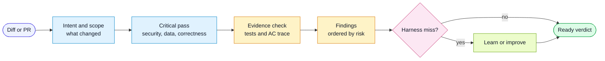

# Workflow: Review

Use this workflow before commit or pull request, and in CI review agents.

## Goal

Find correctness, security, scope, and spec-compliance issues with evidence.

## Flow



## Inputs

- diff
- branch or task intent
- linked spec, if any
- generic rules
- project-local rules for touched layers

## Steps

1. Gather context:
   - changed files
   - staged files if local
   - recent commits
   - branch name
   - linked spec
2. Determine touched surfaces:
   - UI
   - API
   - data
   - auth/security
   - infrastructure
   - docs/harness
3. Check scope drift:
   - files unrelated to intent
   - missing files implied by intent
   - acceptance criteria not addressed
4. Load only relevant rules.
5. Run a critical pass first:
   - secrets
   - auth and authorization
   - injection
   - unsafe data changes
   - sensitive data exposure
   - destructive operations
6. Review each touched surface against rules.
7. Check tests for behavior value and AC traceability.
8. If a spec exists, map acceptance criteria to changed behavior.
9. Run or request relevant static checks.
10. Perform an adversarial self-check: what did the review miss?
11. Report findings ordered by severity.
12. If a repeated harness miss appears, run the learn workflow.

## Output

Use this shape:

```markdown
## Review Summary

Verdict: Ready / Needs fixes / Blocked
Scope: Clean / Scope creep / Requirements missing
Spec: path or none
Layers reviewed: list

### Findings

[Severity] path:line
Rule:
Issue:
Evidence:
Fix:
Re-check:

### Spec Compliance

AC coverage:
Test coverage:

### Harness Feedback

No event needed, or event path and change made.
```

## Confidence

Report high-severity findings only when evidence is concrete. If uncertain, ask
for a narrow verification step instead of asserting.
