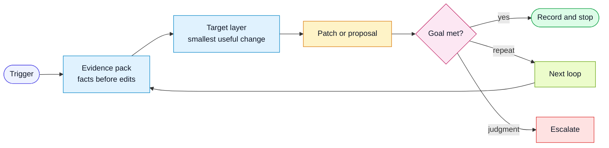

# Workflow: Signal-Triggered Improvement

Use this workflow when a concrete signal suggests the harness can improve.

## Goal

Turn a trigger into the smallest verified harness improvement, with minimal
human effort.

## Flow

## Inputs

- trigger source
- source artifact or log
- linked spec, PR, QA packet, review comment, run trace, or audit finding
- observed miss
- expected future behavior
- available deterministic checks

## Steps

1. Gather hard evidence.
   - Read the source artifact.
   - Identify the exact miss.
   - Confirm whether the miss is recurring or high-risk enough to act on.
2. Classify the signal.
   - `missed-risk`
   - `bad-scope`
   - `missing-evidence`
   - `bad-summary`
   - `bad-test-plan`
   - `design-drift`
   - `rule-gap`
   - `hook-candidate`
   - `eval-candidate`
3. Decide generic vs project-local.
4. Choose the target layer.
   - task
   - workflow
   - role
   - rule
   - template
   - script or hook
   - CI gate
   - eval
   - project docs
5. Define the improvement goal.
   - What future output or check should change?
   - What evidence will prove the change worked?
6. Apply or propose the smallest change.
7. Verify against the original evidence.
   - For a rule or instruction change, exercise the intended violation, a safe
     counterexample, and an unrelated change when feasible.
   - Check that the new guidance catches the target, stays quiet on safe or
     unrelated work, preserves ordinary findings, and produces an actionable
     result.
   - Record any case that could not be exercised and the residual noise or
     coverage risk.
8. Save a signal-triggered improvement record.
9. Decide stop, repeat, or escalate.

## Stop / Repeat / Escalate

- Stop when evidence proves the improvement goal is met.
- Repeat when the fix exposes a second concrete harness miss.
- Escalate when the signal requires product, design, security, or team judgment.

## Guardrails

- Do not auto-promote weak observations into durable rules.
- Do not rewrite broad instruction surfaces for a narrow miss.
- Prefer deterministic checks when the condition can be parsed or tested.
- Keep the loop auditable: record trigger, evidence, change, verification, and
  residual risk.

## Promotion check

Use `evaluate-improvement.md` to compare policy, skill or behavior changes with
a frozen baseline, safe/regression controls and held-out cases. Fixing a proven
deterministic bug can be validated by executable regressions in the same change;
that does not establish a general agent-behavior or productivity improvement.
Capture raw observations through `passive-feedback.md`; curate facts separately
through `continuous-context.md`.
