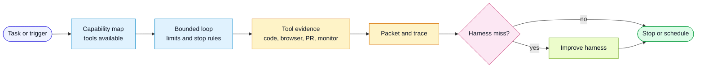

# Workflow: Tool-Assisted Learning Loop

Use this workflow when an agent environment provides tools beyond text response:
code execution, browser automation, repository search, PR tools, background
loops, scheduled jobs, monitors, sub-agents, or proposed-patch mode.

## Goal

Use available tools to gather hard evidence, compress it into structured
signals, and feed recurring misses back into the harness.

## Flow

## Inputs

- task or trigger
- available tool capabilities
- target spec, PR, issue, run trace, audit, or QA packet
- stop condition
- escalation condition

## Steps

1. Identify the job.
   - implementation
   - QA
   - review
   - debugging
   - harness improvement
   - recurring audit
   - monitor or canary
2. Load the relevant task and workflow.
3. Select the minimum capability set.
   - repo/search tools for context
   - code/terminal tools for deterministic checks
   - browser tools for UI and visual evidence
   - PR/issue tools for review signal
   - loop or schedule tools for repeated checks
   - proposed-patch mode for risky harness edits
4. Define bounds.
   - allowed actions
   - max attempts or schedule
   - stop condition
   - escalation condition
5. Run the tool-assisted loop.
6. Emit the right packet.
   - PR Attention Packet
   - QA Impact Packet
   - QA brief
   - Harness Audit
   - Signal-Triggered Improvement
7. Route harness misses to `improve-harness`.
8. Record evidence and outcome.

## Stop Conditions

- check passes
- packet is complete
- target harness patch is verified
- same failure repeats beyond the limit
- required human judgment is identified
- scheduled run has posted its packet

## Guardrails

- Do not use a loop without a stop condition.
- Do not turn scheduled work into noisy reminders.
- Do not let an agent edit broad harness surfaces from weak evidence.
- Prefer proposed patches when the right change requires judgment.
- Keep every tool-assisted run auditable.
